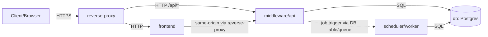

# Architecture (Phase 1)

This document describes the current Phase-1 container/service architecture for Chronos. It focuses on internal authentication (no OIDC yet) and the job-based planning workflow. See [authentication.md](authentication.md) for the detailed login flow.

## Current State (Phase 1)

### Container Topology



### Communication Paths

- Client/Browser -> reverse-proxy: HTTPS
- reverse-proxy -> frontend: HTTP (internal)
- reverse-proxy -> middleware/api: HTTP (internal)
- frontend -> middleware/api: via reverse-proxy (same origin)
- middleware/api -> db: SQL
- scheduler/worker -> db: SQL
- middleware/api -> scheduler/worker: job trigger (DB job table polling by default; queue optional)
- scheduler/worker -> middleware/api: no direct calls (future callbacks only, if added)

### Responsibilities (Containers)

#### reverse-proxy

| Purpose | Inbound/Outbound | Data access | Notes |
| --- | --- | --- | --- |
| TLS termination and routing | Inbound: HTTPS from clients. Outbound: HTTP to frontend and middleware/api. | None | Routes "/" -> frontend and "/api/*" -> middleware/api; optional rate limiting and access logs. |

#### frontend

| Purpose | Inbound/Outbound | Data access | Notes |
| --- | --- | --- | --- |
| Web UI (SPA or SSR) | Inbound: HTTP from reverse-proxy. Outbound: HTTP to middleware/api via reverse-proxy. | None | All planning and authentication requests go to middleware/api; never talks to DB; never stores passwords persistently. |

#### middleware/api

| Purpose | Inbound/Outbound | Data access | Notes |
| --- | --- | --- | --- |
| Central API, auth, orchestration, RBAC | Inbound: HTTP /api/* from reverse-proxy. Outbound: SQL to DB; job trigger to worker via DB table/queue. | Read/write DB | Single entry point for frontend and external API calls; owns OpenAPI contract; enforces RBAC on protected endpoints. |

#### scheduler/worker

| Purpose | Inbound/Outbound | Data access | Notes |
| --- | --- | --- | --- |
| Executes planning jobs and writes results | Inbound: job trigger via DB table/queue. Outbound: SQL to DB. | Read/write DB | No public HTTP API; must be idempotent and safe to retry. |

#### db (Postgres)

| Purpose | Inbound/Outbound | Data access | Notes |
| --- | --- | --- | --- |
| Primary data store for auth and planning | Inbound: SQL from middleware/api and scheduler/worker. Outbound: none. | N/A | Recommend logical separation (e.g., auth_* vs planning_* schemas/tables). |

### Interfaces (Phase 1)

- `POST /auth/login` — internal login and session creation (see [authentication.md](authentication.md)).
- `POST /auth/logout` — session invalidation and cookie expiration.
- `/api/*` — versioned business endpoints (planning, leave, scheduling) defined in OpenAPI specs.

### OpenAPI-First API Contract

- OpenAPI is the source of truth for HTTP APIs.
- Spec location (convention): `docs/api/openapi/<service>/openapi.yaml`.
- The middleware/api owns the public contract; service specs can be aggregated or proxied.

### 12-Factor Alignment

- Configuration via environment variables; secrets never live in the repo.
- Logs go to stdout/stderr as structured events.
- Containers are stateless; state lives in Postgres or other backing services.
- Separate process types: reverse-proxy, frontend, middleware/api, scheduler/worker.
- Build/release/run are separated; the same image runs in all environments.

### Environment Variables (examples)

Examples only; values are placeholders. Use local `.env` files for development if needed, but do not commit secrets.

```bash
# Reverse proxy
PROXY_PUBLIC_HOST=chronos.example.com
PROXY_TLS_CERT_PATH=/run/secrets/CHANGE_ME
PROXY_TLS_KEY_PATH=/run/secrets/CHANGE_ME
PROXY_RATE_LIMIT_RPS=CHANGE_ME

# Middleware/API
DATABASE_URL=postgres://CHANGE_ME@db:5432/chronos
SESSION_SECRET=CHANGE_ME
COOKIE_SECURE=true
COOKIE_SAMESITE=Lax
LOG_LEVEL=info
JOB_QUEUE_URL=CHANGE_ME # optional queue integration

# Scheduler/worker
JOB_POLL_INTERVAL=5s

# Frontend
API_BASE_PATH=/api
```

## Implementation Status (Phase 1)

Concrete tech picks as of the current commit:

| Container | Image / stack | Notes |
| --- | --- | --- |
| reverse-proxy | Traefik v3.2 | **File provider** (no Docker socket), static route config in `infrastructure/docker/traefik/traefik.yaml`, per-env dynamic routes in `traefik/dynamic.dev/` and `traefik/dynamic.prod/`. |
| frontend | `nginx:1.27-alpine` serving a Vite-built React 18 + TypeScript SPA (React Router, `@xyflow/react` for the workflow canvas). | Multi-stage build in `services/frontend/Dockerfile`. |
| middleware/api | `python:3.12-slim` + FastAPI + SQLAlchemy 2 + Alembic | Argon2id password hashing, `itsdangerous`-signed session cookies (HttpOnly, SameSite=Lax). Migrations run on container start. |
| scheduler/worker | `python:3.12-slim` polling skeleton | Jobs table not yet modeled; polling `SELECT 1` as a heartbeat. |
| db | `postgres:18` | Volume mounted at `/var/lib/postgresql` (PG 18 layout). |

### Implemented endpoints

The OpenAPI document at `docs/api/openapi/api/openapi.yaml` is the source of
truth for request/response shapes; refresh it with

```bash
docker compose -f compose.dev.yaml --env-file .env.dev exec api \
  python -m app.cli dump-openapi --output docs/api/openapi/api/openapi.yaml
```

For a quick RBAC-centric summary (method × path × guard), dump the route
matrix:

```bash
docker compose -f compose.dev.yaml --env-file .env.dev exec api \
  python -m app.cli dump-route-matrix --format markdown
```

Phase-1 surface at a glance (14 routers, ~48 routes):

| Router (prefix) | Highlights |
| --- | --- |
| `health` (`/healthz`, `/readyz`) | Public liveness / readiness (readyz runs `SELECT 1`). |
| `auth` (`/auth/*`) | Session cookie login / logout / me; per-IP + per-account rate-limit + lockout (H-02); CSRF token mint (H-10). |
| `users` (`/api/users`) | HR/admin CRUD + role change; `POST /api/users/me/password` self-service rotation (H-04); per-user export (`/{id}/export`). |
| `organization` (`/api/departments`, `/api/teams`) | HR/admin org structure. |
| `projects` (`/api/projects`) | HR/admin project catalog. |
| `preferences` (`/api/preferences`) | Employee SHIFT_TIME / DAY_OFF / PROJECT preferences with `AuditAction.preference_{create,delete}`. |
| `delegates` (`/api/delegates`) | Delegate appointments with `AuditAction.config_change` audit. |
| `leave` (`/api/leave-requests`) | Full leave state machine (DRAFT → DELEGATE → TL → HR) + override + cancel. |
| `shifts` (`/api/shifts`) | TL-or-above CRUD + assign / unassign + `/plan` rule-based planner; `AuditAction.shift_{create,update,delete,assign,unassign,publish}`. |
| `calendar` (`/api/calendar/{user_id}.ics`) | Self-service ICS export. |
| `exports` (`/api/users/{id}/export`) | GDPR JSON export with audit. |
| `reports` (`/api/reports/*`) | TL+ JSON summaries, HR+ CSV export. |
| `audit` (`/api/audit/events`, `/verify`) | HR/admin access; SHA-256 hash chain under `pg_advisory_xact_lock(0x43484152)`. |
| `workflows` (`/api/workflows`) | HR/admin React Flow JSONB storage. |

### Security controls in place

Wave A hardening (H-01..H-10, merged 2026-04-21) covers:

- RBAC enforced via `require_admin()`, `require_hr_or_admin()`,
  `require_tl_or_above()` guard factories — inline role checks are
  forbidden (see `services/api/app/permissions.py`).
- Argon2id password hashing; H-04 policy (length ≥ 12, upper / lower / digit
  / symbol, blocklist); forced rotation flag surfaced through `/auth/me`
  and handled by the SPA's `/change-password` gate.
- Per-IP SlowAPI limiter + per-account lockout on `/auth/login`; session
  rotation on login + idle timeout (H-02, H-03).
- Session secret entropy check at startup when `ENV != dev` (H-09).
- CSRF double-submit on every unsafe method (H-10).
- Append-only audit chain with SHA-256 hashing under
  `pg_advisory_xact_lock(0x43484152)`; every mutating endpoint calls
  `audit.append` (H-07, enforced by `tests/test_audit_coverage.py`).
- `datetime.now(timezone.utc)` only — no naïve timestamps (H-08).
- Prod Traefik (H-06) terminates TLS via ACME (`letsencrypt` resolver,
  staging/prod CA behind `ACME_CA_SERVER`), requires
  `Host(\`${PUBLIC_HOST}\`)` on both routers (404 on any other Host
  header), and applies a security-headers middleware with HSTS
  (2y + subdomains + preload), `X-Content-Type-Options: nosniff`,
  `X-Frame-Options: DENY`, a strict `Referrer-Policy`, a conservative
  `Permissions-Policy`, and a stripped `Server` header. See
  `infrastructure/docker/traefik/dynamic.prod/services.yaml.template` and
  `compose.prod.yaml`.

### Admin bootstrap

The first admin is created via an in-container CLI (no public signup):

```bash
docker compose -f compose.dev.yaml --env-file .env.dev exec api \
  python -m app.cli create-admin --email admin@chronos.local
```

## Planned Later (OIDC/SSO)

- Replace internal login with an OIDC identity provider.
- Middleware validates tokens or exchanges them for server-side sessions.
- Keep IdP-linked identities and claims separated from planning data (e.g., dedicated auth schema).
